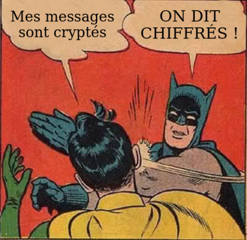

# FCSC 2024 Noise

Noise est la nouvelle application de chat 100% securisée, grâce a son tunnel start-to-start, vos messages sont cryptés de bout en bout. Vous pouvez même partager des secrets avec vos amis, c'est pas génial ça ?

Une version plus difficile de cette épreuve est disponible : Noise (harder).

Auteurs : BitK

Origine : [Noise](https://hackropole.fr/fr/challenges/web/fcsc2024-web-noise/)

Fichiers :
- [noise.tar.xz](noise.tar.xz)
- [noise-fix.patch](noise-fix.patch)

-----------

## Connectez vous

> http://localhost

-----------

## Installation manuel
Vous n'utilisez pas l'application **les CTFs de Cyrhades** ? C'est dommage !
Mais voici comment installer ce CTF manuellement :

> git clone https://github.com/Hack-Oeil/fcsc2024-web-noise.git

> cd fcsc2024-web-noise

-----------

## Sur le site officiel hackropole.fr
> https://hackropole.fr/fr/challenges/web/fcsc2024-web-noise/